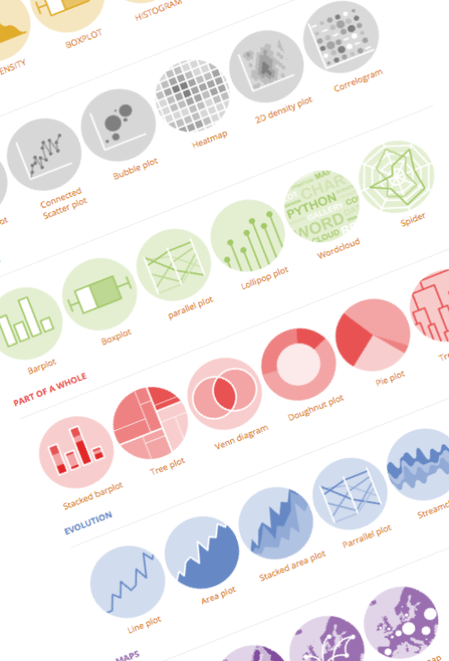

   The Python Graph Gallery
===================

Overview
--------
Welcome to the Github Repository of the [**Python Graph Gallery**](https://www.python-graph-gallery.com/).

The [**Python Graph Gallery**](https://www.python-graph-gallery.com/) is a website that showcases hundreds of graphics, all made using python. Charts are displayed in ~40 categories and are always accompanied by their reproducible code. It allows users to quickly copy and paste a snippet of code and adapt it to their dataset.

The [**Python Graph Gallery**](https://www.python-graph-gallery.com/) is a work developed by Yan Holtz during its nights, weekends, and holidays. Thus, please be indulgent if you find any bug, inconsistency, or potential improvement. By definition, this project will never be finished (datavis possibilities are infinite!)

Contributing
--------
I would be really happy to receive new chart examples that you consider as missing to the gallery. Please note that they must respect certain features:  
- Code must be fully reproducible: a copy and paste must be enough to get the figure  
- Code must be as effective as possible AND well commented    
- Chart must be clearly different from the ones already existing  
- It is a plus if the chart is accompanied by a few explanations on how the code works  

Please send me any suggestion to yan.holtz.data@gmail.com OR add the code to the CONTRIBUTION folder through a pull request. Please note that I keep the decision to add the chart or not, since I want to keep the selection of the charts present in the gallery as efficient as possible.

Last but not least, you probably notice that my English is terrible. I apologize for that, and any mistake feedback is welcome!

Thank you very much for any contribution!

Charts re-utilization
--------
Feel free to reuse any of the charts displayed in the gallery at your convenience! However, please don't forget to **give credit** to this work by citing it! Most importantly, **add links** to the gallery since it allows the website to grow.

Acknowledgment
--------
There are many people I would like to acknowledge:
- Creators of [**Matplotlib**](https://matplotlib.org), [**Seaborn**](https://seaborn.pydata.org), and [**Pandas**](http://pandas.pydata.org). Awesome tools, without them python would be way different, and the gallery would not exist. Sometimes, my examples can be close to their documentation, but I always link their webpages.
- Creators of other libraries and blogs who accepted that I share their creations.
- People who already sent me some feedback / bug reports/proposition of improvement.
- People who said to me thank you! Without that, I would not develop this resource...

- My friend [**Guillaume Guimzu Debreu**](https://www.linkedin.com/in/guillaume-debreu-7b360b125/) without who I would never have had the Idea to make the galleries.
- My friend [**Conor Healy**](http://www.conor.fr), the best designer ever, who did the awesome set of logos.
- My friend **Jean-Phi** for his precious advice.
- My wife **Mel Mulot** who bears me even when I code by night
- All my English speaker friends who correct me with patience (Lou Papéou, Annie-Rose, Cherelle, Kath, Shenfa)

